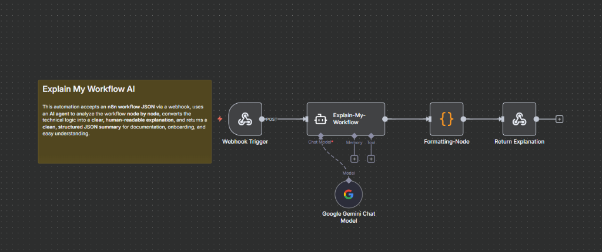

# FlowExplain Ai


An AI-powered tool to analyze and explain your automation workflows. Simply paste your workflow JSON and get a detailed, step-by-step breakdown.

## Features

- **AI-Powered Analysis**: Understand triggers, logic, and complexity in seconds.
- **Support for Multi-Platform**: Works with n8n, Make, and Zapier.
- **Documentation Ready**: Generate clear explanations for onboarding and auditing.

## How It Works

The project consists of two main parts: a **React Frontend** and an **n8n Backend Workflow**.

### 1. React Frontend
- Built with **React**, **Vite**, **shadcn/ui**, and **Tailwind CSS**.
- Provides a clean, modern interface for pasting workflow JSON.
- Sends the JSON data to an n8n webhook for processing.
- Displays the structured AI analysis in a human-readable format.

### 2. n8n Backend Workflow


- **Webhook Trigger**: Receives the workflow JSON from the frontend.
- **AI Agent (Chain of Thought)**: Uses **Google Gemini** to analyze the workflow structure. It evaluates nodes, connections, and logic.
- **Formatting Node**: A JavaScript code node that cleans the AI's raw output, ensuring strictly valid JSON.
- **Response Node**: Returns the final, structured documentation back to the frontend.

This architecture ensures high-speed analysis and consistent, high-quality documentation for even the most complex automation flows.

## How can I edit this code?

If you want to work locally using your own IDE, you can clone this repo and push changes.

The only requirement is having Node.js & npm installed - [install with nvm](https://github.com/nvm-sh/nvm#installing-and-updating)

Follow these steps:

```sh
# Step 1: Clone the repository using the project's Git URL.
git clone <YOUR_GIT_URL>

# Step 2: Navigate to the project directory.
cd <YOUR_PROJECT_NAME>

# Step 3: Install the necessary dependencies.
npm i

# Step 4: Start the development server with auto-reloading and an instant preview.
npm run dev
```

**Edit a file directly in GitHub**

- Navigate to the desired file(s).
- Click the "Edit" button (pencil icon) at the top right of the file view.
- Make your changes and commit the changes.

**Use GitHub Codespaces**

- Navigate to the main page of your repository.
- Click on the "Code" button (green button) near the top right.
- Select the "Codespaces" tab.
- Click on "New codespace" to launch a new Codespace environment.
- Edit files directly within the Codespace and commit and push your changes once you're done.

## What technologies are used for this project?

This project is built with:

- Vite
- TypeScript
- React
- shadcn-ui
- Tailwind CSS

## How can I deploy this project?

You can deploy this project to platforms like Vercel or Netlify.

## Can I connect a custom domain?

Yes, most deployment platforms allow you to connect a custom domain in their project settings.

## License

This project is licensed under the MIT License.

## Contributing

Contributions are welcome! Please feel free to submit a Pull Request.
